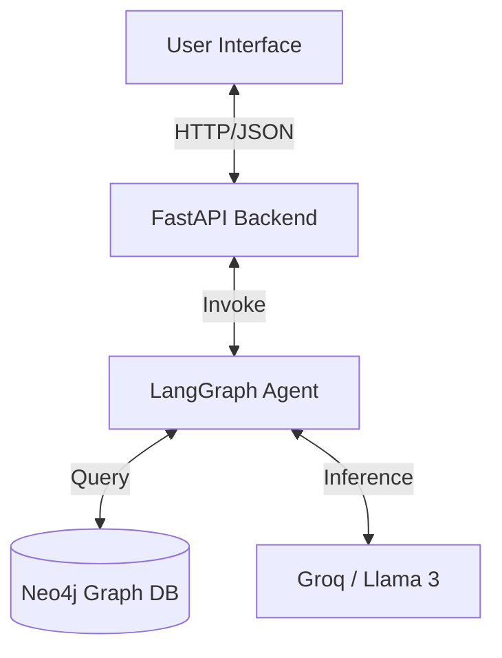
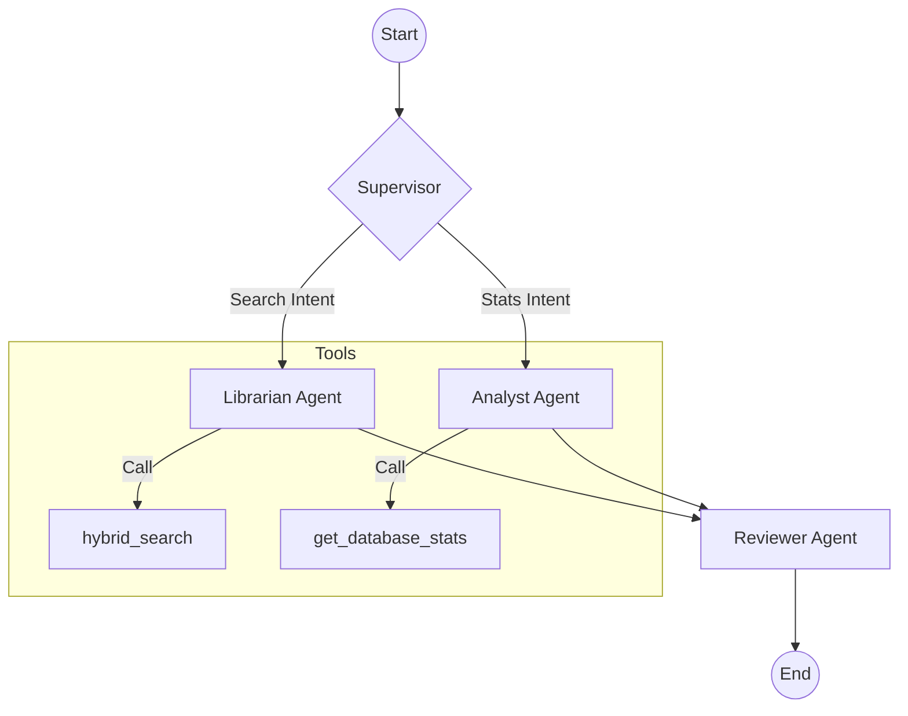
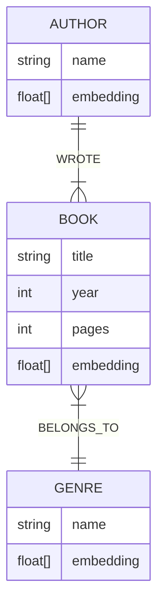

# Project Report: Multi-Agent GenAI Librarian

## 1. System Architecture

The system is built on a **Microservices-like architecture** where the frontend communicates with a FastAPI backend, which orchestrates a Multi-Agent system using LangGraph.

### High-Level Overview


## 2. Agentic Workflow

We utilize a **Hierarchical Control Flow** managed by a Supervisor node. This ensures that specialized tasks are handled by specialized agents.

### Workflow Diagram


### Agent Roles
-   **Supervisor**: The router. Analyzes user input to determine if they need book information or database statistics.
-   **Librarian**: The researcher. Uses the `search_books` tool to query the Neo4j database using a hybrid vector+keyword approach.
-   **Analyst**: The statistician. Uses `get_database_stats` to run aggregation queries (counts) on the graph.
-   **Reviewer**: The editor. Reviews the final output for hallucination and formatting before sending it to the user.

## 3. Knowledge Graph Design

The database is modeled as a Knowledge Graph to capture the relationships between books, authors, and genres, enabling rich context retrieval.

### Graph Schema


### Retrieval Pipeline (GraphRAG)
1.  **Vector Search**: The user's query is embedded and compared against `Book`, `Author`, and `Genre` nodes using Cosine Similarity.
2.  **Graph Traversal**: 
    -   If an `Author` is found, we traverse `[:WROTE]` to find their books.
    -   If a `Genre` is found, we traverse `[:BELONGS_TO]` to find books in that genre.
3.  **Hybrid Filtering**: Results are combined, deduplicated, and filtered by a relevance threshold (0.7) to ensure high precision.

## 4. Backend API

The backend is powered by **FastAPI**.

### Endpoints

#### `POST /ask`
Processes a natural language query.
-   **Request**: `{"query": "Find me romantic books"}`
3.  **General Knowledge/Stats**: Queries for database statistics (e.g., "How many books?") to test tool routing to the Analyst agent.
4.  **Author Search (Fuzzy)**: Queries with typos (e.g., "Samira Hadded") to test the robustness of vector search.

### Metrics
-   **Accuracy**: Percentage of expected keywords found in the response.
-   **Latency**: Time taken to generate a response.
-   **Pass/Fail**: A test passes if all expected keywords are present.

### Running Evaluation
You can run the evaluation suite via the API:
```bash
curl http://localhost:8002/evaluate
```
Or directly via Python:
```bash
python app/evaluate.py
```

## 7. Challenges & Tradeoffs

-   **Duplicate Results**: Initially, the graph traversal returned duplicate books (e.g., a book matched via Title AND Author). We implemented a deduplication logic in Python to resolve this.
-   **Result Overload**: Without limits, vector search returned the entire database. We added a `limit=10` and `threshold=0.7` to balance recall and precision.
-   **Latency**: Vector embedding generation adds a small overhead. We used `all-MiniLM-L6-v2` for a good balance of speed and accuracy.
